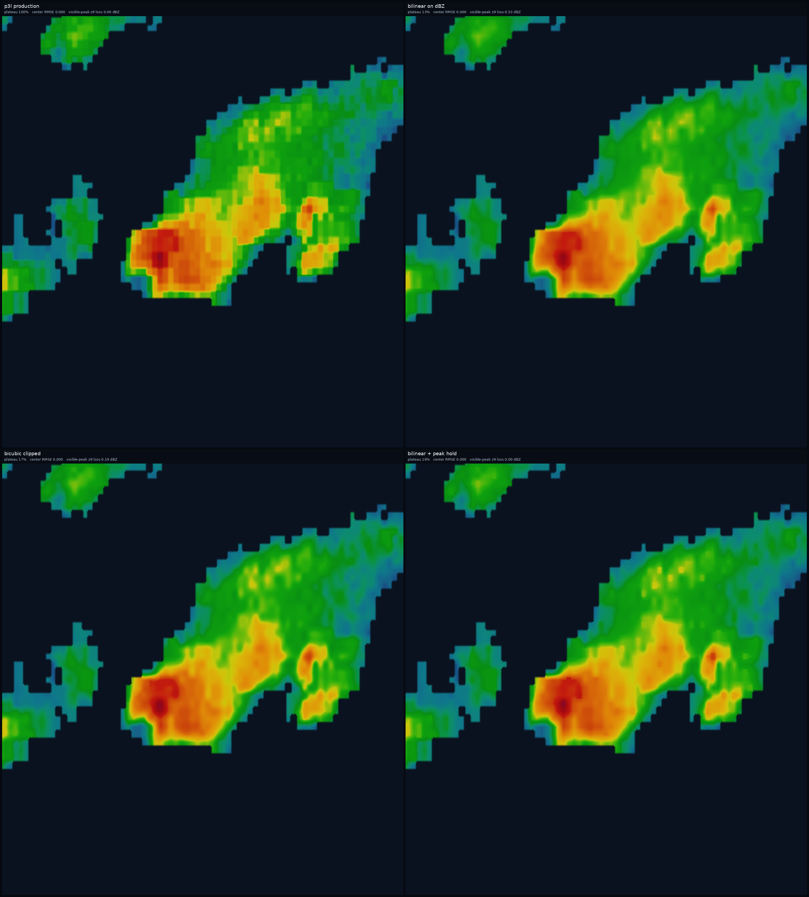
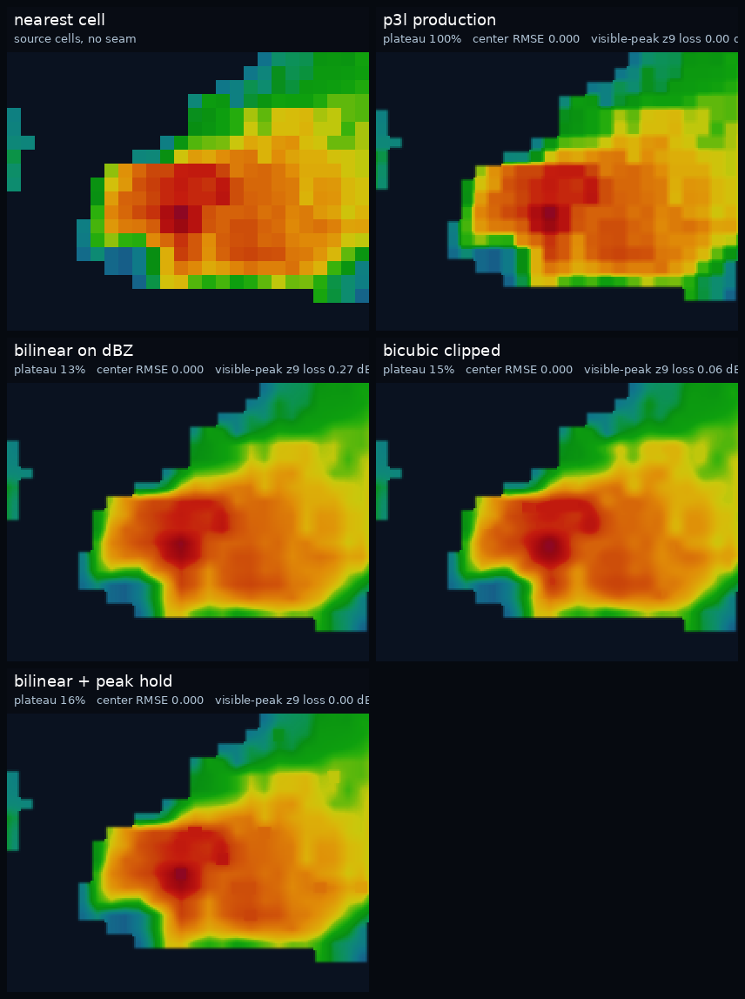
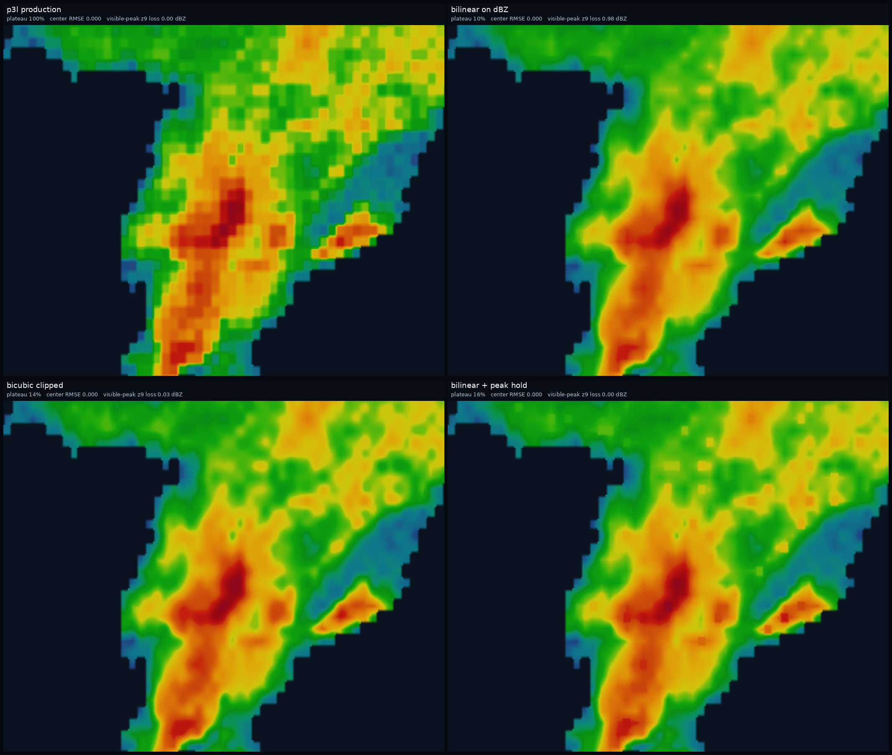
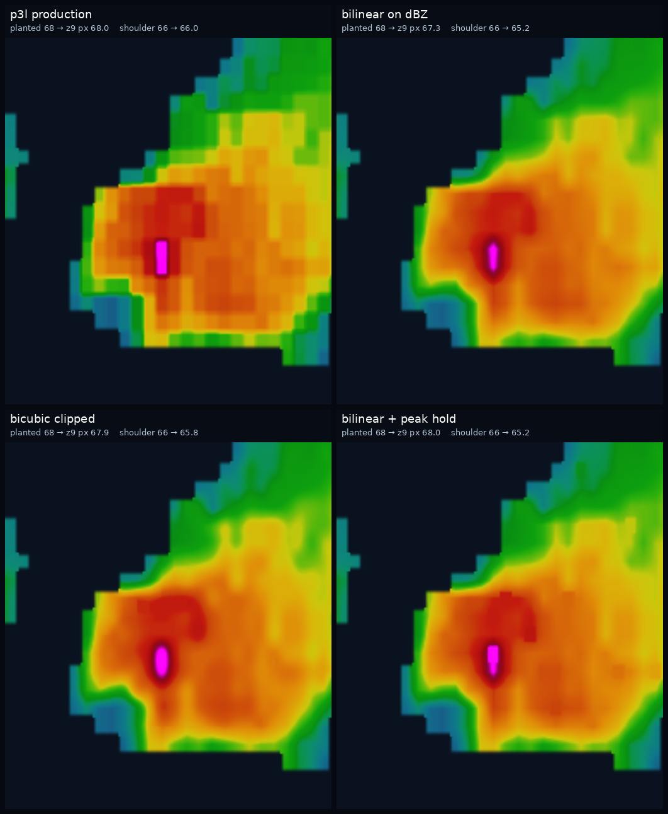

# P3N — bounded numerical dBZ interpolation before the p3k LUT

**Date:** 2026-09-29  
**Frame:** `20260929T004243Z` (the Dickinson shot, MRMS `ReflectivityAtLowestAltitude`)  
**Status:** offline evidence only. Production stamps stay **spatial p3l** and **palette `2026-09-rala-p3k`**. Nothing here is wired into the cooker.

Crops and `metrics.json` live in this directory. Reproduce with:

```bash
PYTHONPATH=src python3 scripts/p3n_dbz_interp_ab.py \
  --grib MRMS_ReflectivityAtLowestAltitude_00.50_20260929-004243.grib2.gz \
  --out docs/p3n-dbz-interp
```

Source object: `s3://noaa-mrms-pds/CONUS/ReflectivityAtLowestAltitude_00.50/20260929/MRMS_ReflectivityAtLowestAltitude_00.50_20260929-004243.grib2.gz`

## Recommendation

Prototype **bilinear + peak hold** behind a default-off dev flag in a later change. Leave `SPATIAL_REVISION` at `p3l` until James signs the crops. This PR does not add that flag.

That candidate is the one that does both jobs the gate asked for:

- The flat interior of ordinary cells goes away (inner-cell plateau 100% → about 16%, and the once-per-cell gradient spike drops by about 4×), on the Dickinson core and on Belle Fourche.
- A local maximum keeps the current p3l footprint, so the worst-case z9 pixel of a 65 dBZ cell in 30 dBZ rain stays 65. Plain bilinear returns 57.4 there. Clipped bicubic returns 62.8.

James still needs to look at the crops before that flag exists. The open question is the weak fringe: cell centers stay exact, and clear air stays empty, but the area-mean of ≤10 dBZ cells rises by about an extra 0.5–1.0 dBZ because the ramp starts at the center. On the Belle Fourche window, 17% of those weak cells rise more than 3 dBZ.

## Where an interpolator would insert

RALA clean does not touch the grid. On this frame, `apply_mode(clean)` with the RALA switches (`apply_dbz_floor`, despeckle, and grid smooth all off) changed dBZ by **0.00**. Axes stayed **float64**.

```
decode_grib2
  classify_dbz          float32 dBZ + category (valid / no-echo / missing)
  lat, lon              float64
cook
  apply_mode(clean)     RALA: grid unchanged
  write_tiles → render_tile(sample_mode="masked-splat")
      Web Mercator pixel centers (_query_lonlat)
      sample_masked_splat
          _splat_echo   ← numerical dBZ. p3l seam. THIS is the slot.
      palette.colorize  ← p3k 0.1 dBZ LUT. RGBA starts here.
      alpha *= edge     ← clear-air inset inside the echo cell
```

p3l already blends dBZ, and only dBZ. Inside `_DETAIL_CORE` (0.28 cell) the sample is the source cell exactly. Past that, a smoothstep reaches a 50/50 face with a valid neighbor. No-echo and missing are not samples. The LUT never sees a blended RGB.

The Dickinson measurement (visible block / native cell ≈ 1) is that 0.28-cell plateau, drawn large by Mapbox overzoom past `max_zoom` 9. Linear filtering softens the seam. It does not fill in the plateau.

A bounded interpolator **replaces the dBZ array** that `sample_masked_splat` hands to `palette.colorize`. Category and `edge_scale` stay on the p3l path, so the A/B below differs only in the numbers that enter the LUT. Upsampling the source grid and then nearest-sampling would invent a finer lattice and the same squares would come back at the next overzoom. The sample sites are the tile pixels, so the blend belongs at query time.

## Candidates

All three are in `src/mpwg_radar/dbz_interp_offline.py`. The cooker does not import that module.

| Candidate | What it does to dBZ | Grid | Maxima / magenta | Cost vs p3l splat on one z9 tile |
| --- | --- | --- | --- | --- |
| **bilinear-masked** | Existing `sample_masked_bilinear`. Exact at the cell center. Invalid corners are left out of the average. | Inner plateau breaks. Value ramps across the cell. | Worst-case z9 pixel (0.137 cell E–W and 0.094 cell N–S off the center, Dickinson pixel size) of a 68-in-30 peak returns **59.7**. A 65-in-30 peak returns **57.4**. | 17 ms, **1.8×** the 9.3 ms splat |
| **bicubic-clipped** | Catmull-Rom on the 4×4 when every tap is valid echo; otherwise bilinear. Clipped to the min/max of the 2×2 cell centers, so the cubic cannot invent a hotter peak. Exact at the cell center. | Inner plateau breaks. The 1-cell gradient spike matches bilinear. | Same worst-case pixel: 68-in-30 returns **65.6** (still magenta, thin margin). 65-in-30 returns **62.8** (under the lock). | 77 ms, **8.3×** |
| **bilinear-peak-hold** | Bilinear on ordinary cells. Where the nearest cell is a plateau-aware local maximum (dBZ ≥ every 8-neighbor), keep the p3l dBZ, core and seam included. | Inner plateau breaks on the field that is not a local max. Real Dickinson/Belle cores keep today's footprint. | Worst-case pixel stays **68** and **65**. On this frame, visible-peak z9 loss is **0**. | 29 ms unfused (**3.1×**), because this offline build runs splat and bilinear and picks. A fused pass would share one neighborhood gather. Paint path: 45 ms vs 15 ms for p3l paint (**2.9×**). |

A limited-radius Gaussian is not in the set. It is not interpolating, so the cell center becomes an average of its neighbors. That is the retired p3h result: a 68 dBZ cell in 30 dBZ rain came back at 62.6.

Benchmark tile: z9 `109/180`, the Dickinson tile from the p3n measurement, sampled against the full 3500×7000 CONUS grid (262144 pixels). Times are this VM, so the ratio is the useful number. At 2000 echo tiles the unfused peak-hold paint is on the order of a minute more than today's paint. Bicubic sampling alone is on the order of two and a half minutes before PNG encode.

## How the crops were made

Same frame as the iPad shot. RALA clean, float64 axes, palette `2026-09-rala-p3k`.

- **Mapbox-like strips** render real z9 tiles, then bilinear-upscale by `2^(10.45−9) ≈ 2.73`, which is the overzoom in the p3n measurement. Alpha uses the p3l clear-air inset for every method.
- **Core field** samples 8 times per native cell in lat/lon, then colorizes. The first panel is nearest-cell, so the native squares are visible next to p3l.
- **Magenta probe** is synthetic. This CONUS frame has **no cell ≥ 65** (Dickinson and Belle Fourche both peak at 58). The probe writes 68 onto the Dickinson 58 cell at 46.945°N, 102.855°W and 66 onto its south neighbor (was 55.5). Those two numbers are not observed dBZ.

Windows:

| Site | West | South | East | North | Valid cells | Max dBZ |
| --- | --- | --- | --- | --- | --- | --- |
| Dickinson | −103.15 | 46.70 | −102.40 | 47.25 | 1223 | 58 |
| Dickinson core | −102.98 | 46.86 | −102.72 | 47.06 | 288 | 58 |
| Belle Fourche | −103.98 | 44.50 | −103.45 | 44.80 | 912 | 58 |

## Metrics

**Plateau fraction.** On every valid cell with an orthogonal neighbor at least 3 dBZ away, sample a 5×5 grid inside ±0.20 cell of the center. Fraction of those samples within 0.05 dBZ of the source cell. ±0.20 sits inside the p3l core, so production scores 1.00 and sub-cell RMS 0. That flat interior is the block.

**Grid pitch.** Median normalized autocorrelation of the horizontal |ΔdBZ| at a lag of one native cell, on echo rows of an 8-sample-per-cell field. p3l spikes there (the seam repeats once per cell). The candidates do not.

**Center RMSE.** Sampled dBZ minus source dBZ at the cell's own lat/lon. Zero means the float64 center-lock still holds.

**Visible-peak z9 loss.** For local maxima at least 2 dBZ above their strongest neighbor, dBZ at the z9 pixel nearest the cell center, subtracted from the source. Positive means that pixel cooled. This is the pixel Mapbox will magnify. It depends on where the pixel grid falls. The harsh column is the guaranteed worst offset, independent of this frame's alignment.

**Weak lift.** Mean of (area-mean inside ±0.40 cell − source) for valid cells ≤ 10 dBZ. The ±0.40 window includes p3l's existing seam, so production is not zero. `>3 dBZ` is the fraction of those cells whose area-mean rises more than 3 dBZ. Centers of the same cells are inside the RMSE above. Clear-air leaks are samples at no-echo centers that came back finite. All four methods scored **0** leaks.

### Dickinson core

| Method | Plateau | Sub-cell RMS | Grid ac at 1 cell | Center RMSE | Visible-peak z9 loss | Weak mean lift |
| --- | --- | --- | --- | --- | --- | --- |
| p3l | 1.00 | 0.00 | 0.137 | 0 | 0.00 (1 peak) | 0.70 |
| bilinear | 0.13 | 1.20 | 0.036 | 0 | 0.27 | 1.48 |
| bicubic clipped | 0.15 | 1.14 | 0.036 | 0 | 0.06 | 1.45 |
| bilinear + peak hold | 0.16 | 1.18 | 0.036 | 0 | 0.00 | 1.48 |

Wide Dickinson window (1223 cells, 6 visible peaks, 71 weak cells): plateau 1.00 / 0.13 / 0.17 / 0.19. Bilinear's worst visible-peak z9 loss is 0.53 dBZ. Peak-hold's is 0. Weak cells with lift > 3 dBZ: p3l 0%, the three candidates about 6%.

### Belle Fourche

| Method | Plateau | Sub-cell RMS | Grid ac at 1 cell | Center RMSE | Visible-peak z9 loss | Weak mean lift | Weak lift > 3 |
| --- | --- | --- | --- | --- | --- | --- | --- |
| p3l | 1.00 | 0.00 | 0.180 | 0 | 0.00 (8 peaks) | 0.88 | 2% |
| bilinear | 0.10 | 1.21 | 0.045 | 0 | 0.98 | 1.84 | 17% |
| bicubic clipped | 0.14 | 1.09 | 0.047 | 0 | 0.03 | 1.67 | 15% |
| bilinear + peak hold | 0.16 | 1.17 | 0.049 | 0 | 0.00 | 1.84 | 17% |

### Magenta, two ways

Worst-case z9 half-pixel, one hot cell in a field of 30 dBZ:

| Source | p3l | bilinear | bicubic | peak hold |
| --- | --- | --- | --- | --- |
| 68 | 68.0 | 59.7 | 65.6 | 68.0 |
| 65 | 65.0 | 57.4 | 62.8 | 65.0 |

Planted into the real Dickinson neighborhood (neighbors are the observed ~46–55 dBZ field, and this frame's z9 pixel happens to sit close to the center):

| Cell | p3l | bilinear | bicubic | peak hold | peak hold, also pin ≥65 |
| --- | --- | --- | --- | --- | --- |
| 68 local max | 68.0 | 67.3 | 67.9 | 68.0 | 68.0 |
| 66 shoulder (not a local max) | 66.0 | 65.2 | 65.8 | 65.2 | 66.0 |

The planted pixels stay magenta for every method **on this alignment**. That is why the harsh column is the gate. A 65 dBZ cell with cold neighbors loses magenta under bilinear and under bicubic as soon as the pixel center is half a pixel off the source cell. Peak-hold does not, because that offset (0.14 cell) is inside the 0.28 core p3l already treats as exact.

The ≥65 pin is a sensitivity, not a fourth candidate. It matters for a magenta shoulder that is cooler than a neighbor. On this probe the shoulder stayed at 65.2 without it.

## Crops

Dickinson, z9 tiles upscaled the way Mapbox did on the iPad shot:



Dickinson core at 8 samples per native cell. Nearest cell is the source grid. p3l is flat inside each cell. The three candidates carry the neighbor-to-neighbor steps as ramps:



Belle Fourche, same z9 overzoom:



Planted 68 / 66 on the Dickinson core (not observed). Labels are the z9 pixel nearest each planted cell:



## What stays locked

float64 lat/lon axes, native max zoom 9, palette p3k, spatial p3l on the default path, no seam retune, weak/no-echo category mask, magenta handled by keeping source dBZ on local maxima, loop architecture untouched. No blur, no sharpen, no artificial contour bands, no Phase 4, no production stamp change.
